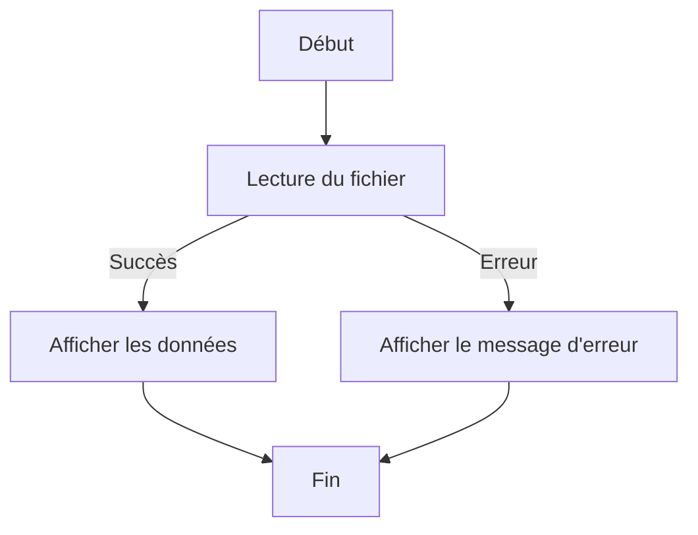

# Gestion de l'Asynchronisme dans Node.js

## Introduction
L'asynchronisme est au cœur du fonctionnement de Node.js. Cela permet à l'application de gérer des tâches longues (comme la lecture de fichiers ou des requêtes réseau) sans bloquer le reste de l'exécution.

Dans ce document, nous allons explorer les trois principaux mécanismes pour gérer l'asynchronisme : **callbacks**, **promises**, et **async/await**. Nous inclurons des exemples détaillés et des cas pratiques.

---

## 1. Les Callbacks
Un **callback** est une fonction passée en argument à une autre fonction. Cette dernière exécute le callback une fois qu'une tâche asynchrone est terminée.

### Exemple avec `fs.readFile`

```javascript
const fs = require('fs');

fs.readFile('example.txt', 'utf8', (err, data) => {
    if (err) {
        console.error('Erreur lors de la lecture du fichier :', err);
        return;
    }
    console.log('Contenu du fichier :', data);
});
```

### Détails :
- **`fs.readFile`** : Fonction asynchrone pour lire un fichier.
- **Callback** : Reçoit deux arguments : une erreur (`err`) et les données lues (`data`).

### Inconvénient des Callbacks
- Les callbacks imbriqués peuvent entraîner ce qu'on appelle le **callback hell**, rendant le code difficile à lire et à maintenir.

```javascript
operation1((err, result1) => {
    if (err) return handleError(err);
    operation2(result1, (err, result2) => {
        if (err) return handleError(err);
        operation3(result2, (err, result3) => {
            if (err) return handleError(err);
            console.log(result3);
        });
    });
});
```

---

## 2. Les Promesses
Une **Promise** est un objet qui représente la valeur future d'une opération asynchrone. Elle peut être dans l'un des états suivants :
- **Pending** : En attente.
- **Fulfilled** : Réussie.
- **Rejected** : Échouée.

### Exemple de Promesse avec `fs.promises`

```javascript
const fs = require('fs').promises;

fs.readFile('example.txt', 'utf8')
    .then(data => {
        console.log('Contenu du fichier :', data);
    })
    .catch(err => {
        console.error('Erreur lors de la lecture du fichier :', err);
    });
```

### Création Manuelle d'une Promesse

```javascript
function attendre(ms) {
    return new Promise((resolve) => {
        setTimeout(() => {
            resolve(`Attente terminée après ${ms} ms`);
        }, ms);
    });
}

attendre(2000).then(message => console.log(message));
```

---

## 3. Async/Await
**Async/await** est une syntaxe moderne qui simplifie la gestion des promesses en rendant le code plus lisible.

### Exemple avec `fs.promises`

```javascript
const fs = require('fs').promises;

async function lireFichier() {
    try {
        const data = await fs.readFile('example.txt', 'utf8');
        console.log('Contenu du fichier :', data);
    } catch (err) {
        console.error('Erreur lors de la lecture du fichier :', err);
    }
}

lireFichier();
```

### Points Clés
- **`async`** : Indique qu'une fonction contient des opérations asynchrones.
- **`await`** : Pause l'exécution jusqu'à ce que la promesse soit résolue.

---

## 4. Comparaison des Méthodes

| **Méthode**       | **Avantages**                                                                                     | **Inconvénients**                                                             |
|--------------------|---------------------------------------------------------------------------------------------------|--------------------------------------------------------------------------------|
| **Callback**       | Simple et natif à Node.js.                                                                        | Difficulté de lecture avec des callbacks imbriqués.                           |
| **Promise**        | Enchaînement clair des opérations avec `.then()` et `.catch()`.                                   | Peut devenir verbeux pour des séquences complexes.                            |
| **Async/Await**    | Syntaxe propre et facile à lire, semblable à du code synchrone.                                   | Nécessite un environnement moderne (Node.js 8+).                              |

---

## 5. Cas Pratique : Requête HTTP avec `axios`

### Installation
```bash
npm install axios
```

### Code Complet

```javascript
const axios = require('axios');

async function fetchData() {
    try {
        const response = await axios.get('https://jsonplaceholder.typicode.com/posts/1');
        console.log('Données récupérées :', response.data);
    } catch (err) {
        console.error('Erreur lors de la requête HTTP :', err);
    }
}

fetchData();
```

### Diagramme Mermaid


---

## Conclusion
- **Callbacks** sont utiles pour des tâches simples mais deviennent difficiles à gérer pour des workflows complexes.
- **Promises** offrent une meilleure gestion des erreurs et un flux plus clair.
- **Async/await** est le choix privilégié pour écrire du code asynchrone lisible et maintenable.

Pratiquer ces concepts avec des exemples réels vous aidera à maîtriser l'asynchronisme dans Node.js. Si vous avez des questions, n'hésitez pas à demander !

