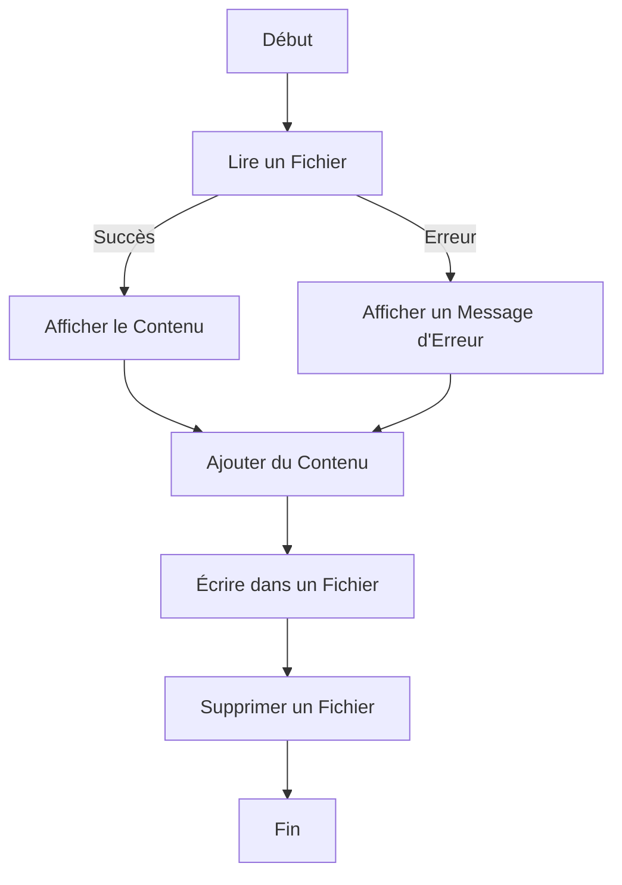

# Le Système de Fichiers (fs) dans Node.js

## Introduction
Le module **`fs`** de Node.js permet d'interagir avec le système de fichiers pour lire, écrire, supprimer, et gérer des fichiers et des dossiers. Ce module est essentiel pour créer des applications serveur ou manipuler des fichiers de manière programmée.

Dans ce document, nous couvrirons les opérations les plus courantes sur les fichiers et les dossiers, accompagnées d'exemples détaillés.

---

## 1. Importation du Module `fs`
Pour utiliser le module **`fs`**, il suffit de l'importer au début de votre fichier :

```javascript
const fs = require('fs');
```

Node.js fournit deux versions des fonctions du module `fs` :
- **Synchrones** (bloquantes).
- **Asynchrones** (non bloquantes), recommandées pour éviter de bloquer le thread principal.

Pour les opérations modernes, **`fs.promises`** offre une syntaxe basée sur des promesses.

---

## 2. Lecture de Fichiers
### a) Lecture Asynchrone

```javascript
const fs = require('fs');

fs.readFile('example.txt', 'utf8', (err, data) => {
    if (err) {
        console.error('Erreur lors de la lecture du fichier :', err);
        return;
    }
    console.log('Contenu du fichier :', data);
});
```

### b) Lecture avec Promises

```javascript
const fs = require('fs').promises;

async function lireFichier() {
    try {
        const data = await fs.readFile('example.txt', 'utf8');
        console.log('Contenu du fichier :', data);
    } catch (err) {
        console.error('Erreur lors de la lecture :', err);
    }
}

lireFichier();
```

---

## 3. Écriture dans des Fichiers
### a) Écriture Asynchrone

```javascript
const fs = require('fs');

fs.writeFile('output.txt', 'Bonjour, Node.js !', (err) => {
    if (err) {
        console.error('Erreur lors de l\'écriture :', err);
        return;
    }
    console.log('Fichier écrit avec succès.');
});
```

### b) Écriture avec Promises

```javascript
const fs = require('fs').promises;

async function ecrireFichier() {
    try {
        await fs.writeFile('output.txt', 'Bonjour, Node.js avec Promises !');
        console.log('Écriture terminée.');
    } catch (err) {
        console.error('Erreur lors de l\'écriture :', err);
    }
}

ecrireFichier();
```

---

## 4. Ajouter du Contenu à un Fichier
### Append Asynchrone

```javascript
const fs = require('fs');

fs.appendFile('output.txt', '\nTexte ajouté.', (err) => {
    if (err) {
        console.error('Erreur lors de l\'ajout :', err);
        return;
    }
    console.log('Texte ajouté avec succès.');
});
```

---

## 5. Suppression de Fichiers

```javascript
const fs = require('fs');

fs.unlink('output.txt', (err) => {
    if (err) {
        console.error('Erreur lors de la suppression :', err);
        return;
    }
    console.log('Fichier supprimé avec succès.');
});
```

---

## 6. Gestion des Dossiers
### Création d'un Dossier

```javascript
const fs = require('fs');

fs.mkdir('nouveau_dossier', { recursive: true }, (err) => {
    if (err) {
        console.error('Erreur lors de la création du dossier :', err);
        return;
    }
    console.log('Dossier créé avec succès.');
});
```

### Suppression d'un Dossier

```javascript
fs.rmdir('nouveau_dossier', { recursive: true }, (err) => {
    if (err) {
        console.error('Erreur lors de la suppression du dossier :', err);
        return;
    }
    console.log('Dossier supprimé avec succès.');
});
```

---

## 7. Liste des Fichiers dans un Dossier

```javascript
const fs = require('fs');

fs.readdir('.', (err, files) => {
    if (err) {
        console.error('Erreur lors de la lecture du dossier :', err);
        return;
    }
    console.log('Fichiers dans le dossier courant :', files);
});
```

---

## 8. Diagramme Mermaid : Opérations sur Fichiers



---

## Conclusion
Le module **`fs`** offre une large gamme de fonctionnalités pour interagir avec le système de fichiers. Bien que les fonctions synchrones puissent être utiles dans certains cas, il est recommandé d'utiliser les fonctions asynchrones ou basées sur des promesses pour garantir la performance et l'évolutivité de vos applications.

Si vous avez des besoins spécifiques ou des questions, je peux fournir des exemples supplémentaires adaptés à vos cas d'utilisation !

