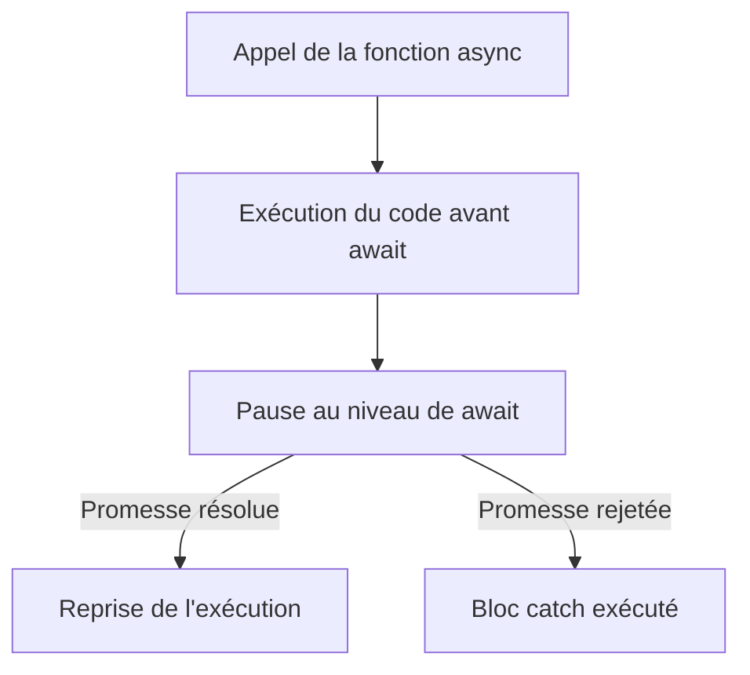
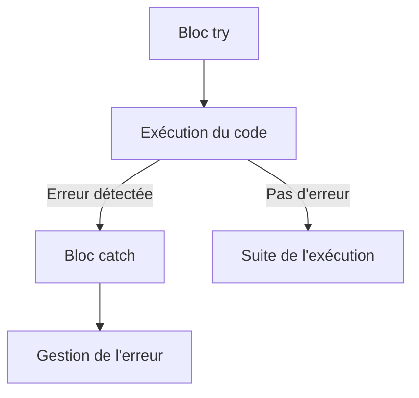
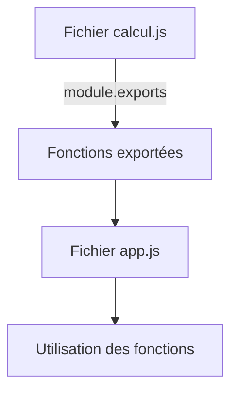

# Guide Ludique sur les Concepts Clés : `async`, `console.log`, `try/catch`, `throw`, et `module.exports`

## Introduction
Dans ce guide, nous allons explorer les concepts et syntaxes essentiels de Node.js, tels que :
- `async/await`
- `console.log`
- Gestion des erreurs : `try`, `catch` et `throw`
- Exportation de modules avec `module.exports`

Chacun de ces concepts sera détaillé avec des exemples pratiques et des schémas explicatifs.

---

## 1. `async/await`

### Définition
- **`async`** : Indique qu'une fonction contient des opérations asynchrones.
- **`await`** : Pause l'exécution jusqu'à ce qu'une promesse soit résolue ou rejetée.

### Exemple de Fonction Asynchrone
```javascript
async function fetchData() {
    try {
        const response = await fetch('https://api.example.com/data');
        const data = await response.json();
        console.log(data);
    } catch (error) {
        console.error('Erreur lors de la récupération des données :', error);
    }
}
fetchData();
```

### Diagramme Explicatif


### Points Clés
- Facilite la lecture du code asynchrone.
- Réduit l'imbriquement comparé aux callbacks.

---

## 2. `console.log`

### Définition
- `console.log` est une méthode utilisée pour afficher des messages ou des données dans la console (principalement pour le débogage).

### Exemple Simple
```javascript
const nom = 'Alice';
console.log('Bonjour,', nom); // Affiche : Bonjour, Alice
```

### Cas d'Utilisation
- Déboguer des valeurs intermédiaires.
- Suivre le flux d'exécution.

### Autres Méthodes de `console`
- **`console.error`** : Affiche les messages d'erreur.
- **`console.table`** : Affiche les données sous forme de tableau.

---

## 3. Gestion des Erreurs : `try`, `catch` et `throw`

### Définition
- **`try`** : Bloc où le code est exécuté.
- **`catch`** : Bloc pour gérer les erreurs si elles surviennent dans le bloc `try`.
- **`throw`** : Permet de générer une erreur manuellement.

### Exemple de Base
```javascript
function diviser(a, b) {
    if (b === 0) {
        throw new Error('Division par zéro interdite !');
    }
    return a / b;
}

try {
    console.log(diviser(10, 0));
} catch (error) {
    console.error('Erreur détectée :', error.message);
}
```

### Diagramme Explicatif


---

## 4. Exporter des Modules avec `module.exports`

### Définition
- `module.exports` permet d'exporter du code (fonctions, objets, etc.) depuis un fichier pour le réutiliser ailleurs.

### Exemple
#### `calcul.js`
```javascript
function addition(a, b) {
    return a + b;
}

function multiplication(a, b) {
    return a * b;
}

module.exports = { addition, multiplication };
```

#### `app.js`
```javascript
const { addition, multiplication } = require('./calcul');

console.log(addition(2, 3)); // Affiche : 5
console.log(multiplication(4, 5)); // Affiche : 20
```

### Diagramme Explicatif


---

## Conclusion
Ces concepts fondamentaux de Node.js et JavaScript vous permettent de :
- Travailler efficacement avec des opérations asynchrones.
- Déboguer et gérer les erreurs de manière professionnelle.
- Organiser votre code en modules réutilisables.

Pratiquez chaque concept avec des exercices pour mieux les assimiler. Si vous avez besoin de clarifications ou d'autres exemples, faites-le-moi savoir !

