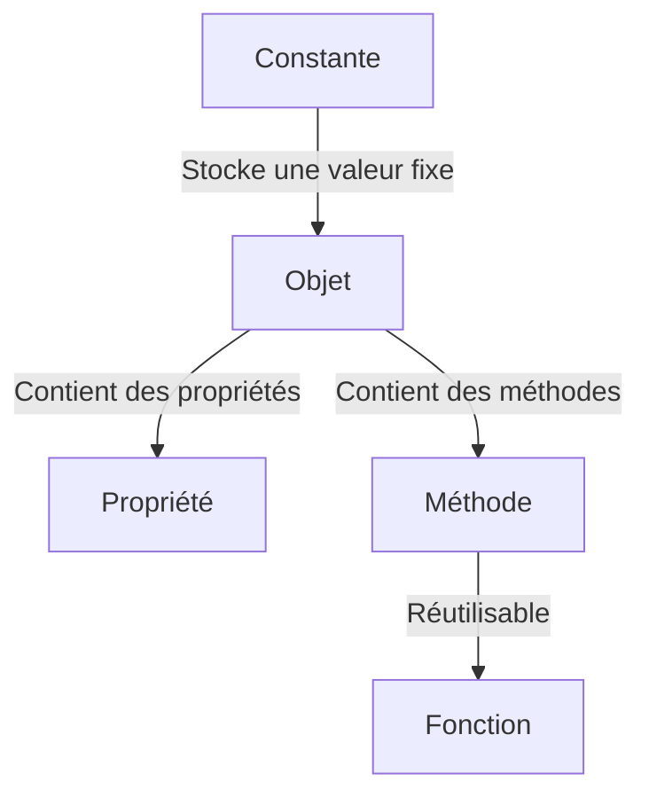

# Guide Complet sur les Constantes, Fonctions et Objets Associés en JavaScript

## Introduction
Dans JavaScript (et donc dans Node.js), comprendre les constantes, les fonctions, et les objets est essentiel pour écrire du code clair et efficace. Ce guide vous expliquera les concepts suivants avec des exemples simples, des diagrammes, et une approche ludique :
- **Constantes (`const`)**
- **Fonctions**
- **Objets et méthodes associées**

---

## 1. Les Constantes : `const`

### Définition
`const` est utilisé pour déclarer une variable dont la valeur ne peut pas être réassignée. Cela ne signifie pas que l'objet ou le tableau référencé par cette constante est immuable.

### Syntaxe
```javascript
const PI = 3.14;
console.log(PI); // Affiche : 3.14

// Erreur si on tente de réassigner
PI = 3.14159; // TypeError : Assignment to constant variable.
```

### Utilité
- Garantir qu'une valeur ne change pas accidentellement.
- Indiquer clairement une intention au lecteur du code.

### Exemple avec des objets
Les propriétés d'un objet déclaré avec `const` peuvent être modifiées.
```javascript
const voiture = { marque: 'Toyota', modele: 'Corolla' };
voiture.modele = 'Yaris'; // Ceci est autorisé
console.log(voiture); // Affiche : { marque: 'Toyota', modele: 'Yaris' }

// Mais : voiture = {} provoquera une erreur.
```

---

## 2. Les Fonctions

### Définition
Une fonction est un bloc de code réutilisable qui peut effectuer une tâche spécifique et retourner un résultat.

### Types de Fonctions

#### a) Fonctions Déclarées
Les fonctions déclarées sont définies avec le mot-clé `function`.
```javascript
function ajouter(a, b) {
    return a + b;
}

console.log(ajouter(3, 5)); // Affiche : 8
```

#### b) Fonctions Anonymes
Les fonctions anonymes n'ont pas de nom et sont souvent utilisées dans des callbacks.
```javascript
const direBonjour = function() {
    console.log('Bonjour !');
};

direBonjour();
```

#### c) Fonctions Fléchées (Arrow Functions)
Introduites avec ES6, elles offrent une syntaxe concise et gèrent différemment le mot-clé `this`.
```javascript
const multiplier = (a, b) => a * b;
console.log(multiplier(4, 6)); // Affiche : 24
```

### Avantages des Fonctions Fléchées
- Syntaxe plus courte.
- Pas de liaison propre à `this`, ce qui simplifie l'utilisation dans certains cas.

### Paramètres par Défaut
Les fonctions peuvent avoir des paramètres par défaut.
```javascript
function saluer(nom = 'inconnu') {
    console.log(`Bonjour, ${nom} !`);
}
saluer(); // Affiche : Bonjour, inconnu !
saluer('Alice'); // Affiche : Bonjour, Alice !
```

---

## 3. Les Objets et leurs Méthodes

### Définition
Un objet est une collection de propriétés et de méthodes. Les propriétés sont des variables attachées à l'objet, et les méthodes sont des fonctions attachées à cet objet.

### Exemple Simple
```javascript
const utilisateur = {
    nom: 'John',
    age: 30,
    saluer: function() {
        console.log(`Bonjour, je m'appelle ${this.nom}.`);
    }
};

utilisateur.saluer(); // Affiche : Bonjour, je m'appelle John.
```

### Création d'Objet avec une Classe
Les classes permettent de créer des objets avec un modèle.
```javascript
class Animal {
    constructor(nom, espece) {
        this.nom = nom;
        this.espece = espece;
    }

    decrire() {
        return `${this.nom} est un(e) ${this.espece}.`;
    }
}

const chat = new Animal('Félix', 'chat');
console.log(chat.decrire()); // Affiche : Félix est un(e) chat.
```

---

## 4. Diagramme Mermaid : Relation entre Constantes, Fonctions et Objets



---

## 5. Bonnes Pratiques

### Utiliser `const` par Défaut
- Utilisez `let` uniquement lorsque la variable doit être réassignée.

### Nommer les Fonctions et Variables de Manière Significative
- Préférez des noms clairs comme `calculerSomme` plutôt que `cs`.

### Modulariser le Code
- Divisez le code en fonctions réutilisables pour améliorer sa lisibilité et sa maintenance.

---

## Conclusion
En maîtrisant les constantes, les fonctions, et les objets, vous serez capable de structurer votre code de manière claire et efficace. Ces concepts sont fondamentaux pour progresser dans JavaScript et Node.js. Si vous souhaitez approfondir un aspect ou ajouter un exemple spécifique, faites-le-moi savoir !

