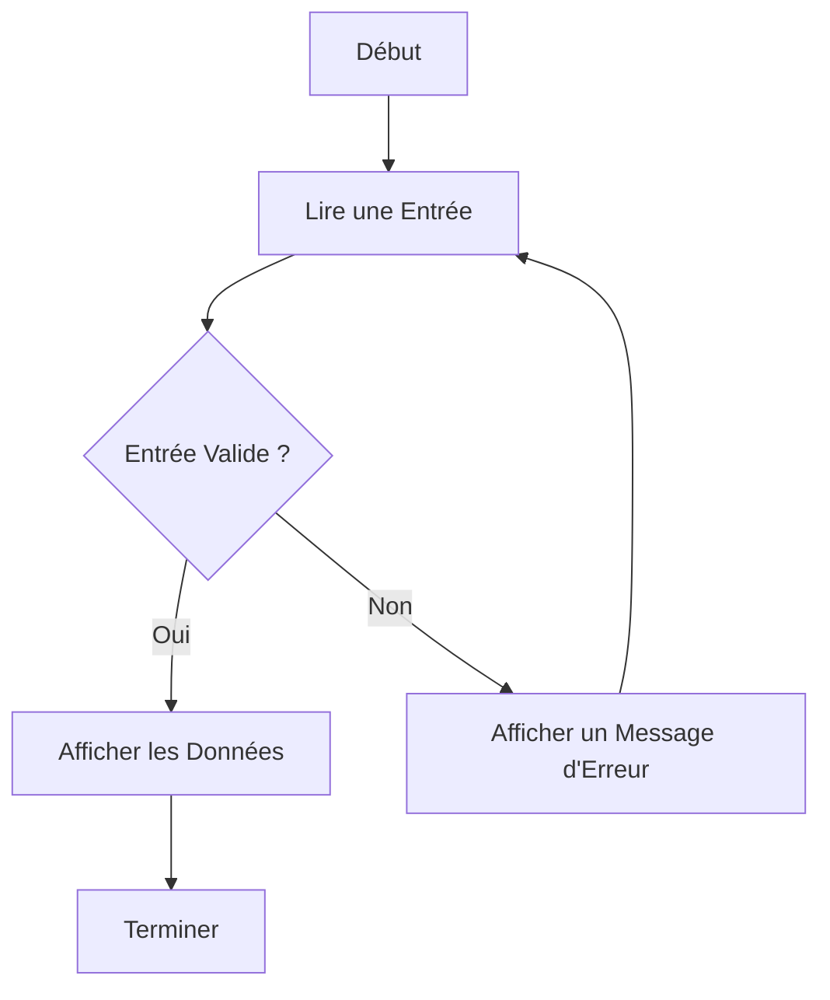

# Utilisation de `stdin` dans Node.js

## Introduction
Dans Node.js, le module **`process`** permet de gérer les flux d'entrée et de sortie standard. **`stdin`** (standard input) est utilisé pour lire les données saisies par l'utilisateur via la console ou un autre processus.

Ce manuel explique comment utiliser `stdin` dans différents scénarios avec des exemples détaillés.

---

## 1. Lecture Simple depuis `stdin`

Le flux `stdin` est accessible via `process.stdin`.

### Exemple : Lecture et Affichage des Données

```javascript
process.stdin.setEncoding('utf8'); // Définir l'encodage des données en UTF-8

console.log('Veuillez entrer un texte :');

process.stdin.on('data', (data) => {
    console.log(`Vous avez saisi : ${data.trim()}`);
    process.exit(); // Quitter le programme après la saisie
});
```

### Explications
- **`process.stdin.setEncoding('utf8')`** : Définit l'encodage pour convertir les données brutes en texte lisible.
- **`process.stdin.on('data', callback)`** : Écoute les données entrantes.
- **`process.exit()`** : Termine le processus une fois les données traitées.

---

## 2. Lecture Continue et Traitement des Données
Dans certains cas, vous pouvez vouloir lire plusieurs entrées avant de terminer le programme.

### Exemple : Lecture Multiple

```javascript
process.stdin.setEncoding('utf8');

console.log('Entrez plusieurs lignes (tapez "exit" pour quitter) :');

process.stdin.on('data', (data) => {
    const input = data.trim();

    if (input === 'exit') {
        console.log('Programme terminé.');
        process.exit();
    }

    console.log(`Vous avez saisi : ${input}`);
});
```

### Explications
- **Boucle d'écoute** : Tant que l'utilisateur ne saisit pas "exit", le programme continue à écouter les entrées.
- **`trim()`** : Supprime les espaces inutiles autour de l'entrée.

---

## 3. Lecture en Mode Bloc (Lecture par Chunks)
`stdin` peut être lu par morceaux (chunks), utile pour traiter de grandes quantités de données.

### Exemple : Traitement en Chunks

```javascript
let data = '';

process.stdin.on('data', (chunk) => {
    data += chunk;
});

process.stdin.on('end', () => {
    console.log(`Données complètes reçues :\n${data}`);
});
```

### Explications
- **Accumulation des données** : Les chunks sont ajoutés à la variable `data` jusqu'à la fin du flux.
- **`process.stdin.on('end')`** : Déclenché lorsque le flux est terminé (par exemple, avec `Ctrl+D` dans la console).

---

## 4. Lecture avec Interface `readline`
Le module **`readline`** simplifie la gestion des entrées utilisateur.

### Exemple : Questionnaire Interactif

```javascript
const readline = require('readline');

const rl = readline.createInterface({
    input: process.stdin,
    output: process.stdout
});

rl.question('Quel est votre nom ? ', (nom) => {
    console.log(`Bonjour, ${nom} !`);
    rl.close();
});
```

### Explications
- **`readline.createInterface`** : Crée une interface interactive pour les entrées/sorties.
- **`rl.question`** : Pose une question et attend une réponse.
- **`rl.close`** : Ferme l'interface après le traitement.

---

## 5. Utilisation Avancée : Lecture et Validation
Vous pouvez ajouter une logique de validation ou d'analyse des entrées.

### Exemple : Vérification d'une Saisie Numérique

```javascript
const readline = require('readline');

const rl = readline.createInterface({
    input: process.stdin,
    output: process.stdout
});

function demanderNombre() {
    rl.question('Veuillez entrer un nombre : ', (input) => {
        const nombre = parseFloat(input);

        if (isNaN(nombre)) {
            console.log('Ce n\'est pas un nombre valide. Réessayez.');
            demanderNombre(); // Relance la question
        } else {
            console.log(`Vous avez entré : ${nombre}`);
            rl.close();
        }
    });
}

demanderNombre();
```

### Explications
- **`parseFloat(input)`** : Convertit la saisie en un nombre à virgule flottante.
- **Validation** : Vérifie si la saisie est un nombre avant de continuer.

---

## 6. Diagramme Mermaid : Gestion de `stdin`



---

## 7. Bonnes Pratiques
- Toujours valider les entrées pour éviter des comportements inattendus.
- Utiliser le module **`readline`** pour des applications interactives complexes.
- Ajouter des messages clairs pour guider l'utilisateur.
- Tester le programme avec différents types d'entrées (vides, incorrectes, etc.).

---

## Conclusion
La gestion des entrées standard dans Node.js est essentielle pour créer des applications interactives ou traiter des flux de données. En combinant les techniques de base avec des outils avancés comme `readline`, vous pouvez construire des interfaces robustes et conviviales.


