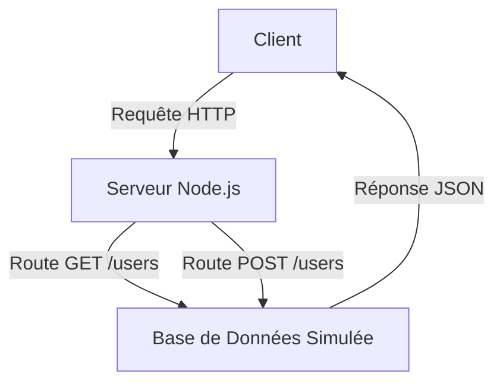

# Tutoriel : Maîtriser Node.js (Les Bases Essentielles)

## Introduction
Node.js est une plateforme JavaScript qui permet d'exécuter du code côté serveur. Ce tutoriel fournit une vue d'ensemble complète des éléments fondamentaux que vous devez connaître pour devenir opérationnel avec Node.js. Il inclut des concepts, des exemples et des tableaux récapitulatifs.

---

## 1. Concepts de Base de Node.js

| **Concept**              | **Description**                                                                                         | **Exemple**                                   |
|--------------------------|---------------------------------------------------------------------------------------------------------|-----------------------------------------------|
| **Node.js**              | Environnement d'exécution JavaScript, idéal pour les applications asynchrones.                         | `node app.js`                                 |
| **Single-threaded**      | Node.js fonctionne sur un seul thread, mais peut gérer plusieurs requêtes grâce à l'event loop.         | Automatique                                   |
| **Asynchronisme**        | Les opérations lentes (lecture de fichiers, requêtes réseau) sont effectuées sans bloquer le programme. | `fs.readFile('file.txt', callback);`          |
| **Event Loop**           | Mécanisme interne permettant de gérer les tâches asynchrones.                                          | Transparent pour l'utilisateur                |
| **Non-bloquant**         | Une requête n'attend pas que l'autre soit terminée.                                                    | `setTimeout(() => console.log('Hello'), 1000);` |

---

## 2. Gestionnaire de Paquets : npm

### Commandes de Base

| **Commande**               | **Description**                                                        |
|----------------------------|------------------------------------------------------------------------|
| `npm init`                 | Initialise un projet et crée un fichier `package.json`.               |
| `npm install <package>`    | Installe un package et l'ajoute aux dépendances du projet.            |
| `npm uninstall <package>`  | Désinstalle un package.                                               |
| `npm update`               | Met à jour tous les packages à leurs dernières versions.              |
| `npm list`                 | Liste les packages installés dans le projet.                         |

### Exemple : Créer un Projet avec npm
```bash
mkdir mon-projet
cd mon-projet
npm init -y
npm install express
```
---

## 3. Modules Natifs de Node.js

Node.js est livré avec des modules intégrés pour gérer les tâches courantes.

| **Module**  | **Description**                                   | **Exemple d'utilisation**                                                   |
|-------------|---------------------------------------------------|------------------------------------------------------------------------------|
| **fs**      | Gestion des fichiers.                            | `fs.readFile('file.txt', callback);`                                       |
| **http**    | Création de serveurs HTTP.                       | `http.createServer((req, res) => res.end('Hello')).listen(3000);`           |
| **path**    | Manipulation des chemins de fichiers.             | `path.join('/folder', 'file.txt');`                                        |
| **os**      | Informations sur le système d'exploitation.       | `os.platform();`                                                           |
| **crypto**  | Opérations de cryptographie.                      | `crypto.randomBytes(16).toString('hex');`                                  |

---

## 4. Exemple de Code : Serveur Web Minimaliste

```javascript
const http = require('http');

const server = http.createServer((req, res) => {
    res.writeHead(200, { 'Content-Type': 'text/plain' });
    res.end('Bonjour, Node.js!');
});

server.listen(3000, () => {
    console.log('Serveur en écoute sur le port 3000');
});
```

### Explication
- **`require('http')`** : Importe le module HTTP intégré.
- **`createServer`** : Crée un serveur qui répond aux requêtes entrantes.
- **`listen(3000)`** : Démarre le serveur sur le port 3000.

---

## 5. Exemple d'API REST avec Express.js

Express est un framework minimaliste pour créer des applications web avec Node.js.

### Étape 1 : Installation d'Express
```bash
npm install express
```

### Étape 2 : Code Complet de l'API REST
```javascript
const express = require('express');
const app = express();
const port = 3000;

// Middleware pour parser le JSON
app.use(express.json());

// Liste des utilisateurs (simulée)
let users = [
    { id: 1, name: 'Alice' },
    { id: 2, name: 'Bob' }
];

// Récupérer tous les utilisateurs
app.get('/users', (req, res) => {
    res.json(users);
});

// Récupérer un utilisateur par ID
app.get('/users/:id', (req, res) => {
    const user = users.find(u => u.id === parseInt(req.params.id));
    if (!user) return res.status(404).send('Utilisateur non trouvé');
    res.json(user);
});

// Ajouter un utilisateur
app.post('/users', (req, res) => {
    const newUser = {
        id: users.length + 1,
        name: req.body.name
    };
    users.push(newUser);
    res.status(201).json(newUser);
});

// Modifier un utilisateur
app.put('/users/:id', (req, res) => {
    const user = users.find(u => u.id === parseInt(req.params.id));
    if (!user) return res.status(404).send('Utilisateur non trouvé');
    user.name = req.body.name;
    res.json(user);
});

// Supprimer un utilisateur
app.delete('/users/:id', (req, res) => {
    users = users.filter(u => u.id !== parseInt(req.params.id));
    res.status(204).send();
});

// Lancer le serveur
app.listen(port, () => {
    console.log(`Serveur en écoute sur http://localhost:${port}`);
});
```

### Diagramme Mermaid


---

## 6. Ressources Complémentaires
- [Documentation officielle de Node.js](https://nodejs.org)
- [Guide Express.js](https://expressjs.com/)
- Tutoriels vidéo disponibles sur YouTube pour une approche visuelle.

---

Ce tutoriel vous donne une base solide pour commencer avec Node.js. Pour aller plus loin, explorez les modules avancés, les bases de données (comme MongoDB) et les tests automatisés.

