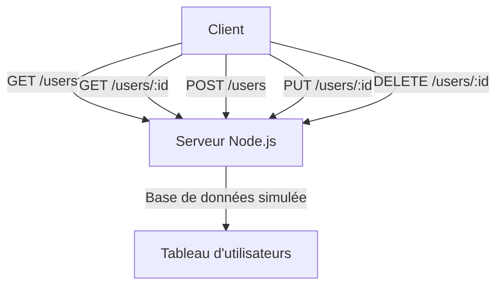

# Code Complet avec Explications et Diagramme pour Node.js

## Introduction
Dans ce fichier, nous allons explorer un exemple complet de projet Node.js. Nous y intégrerons un code fonctionnel, des explications détaillées sur chaque section et un diagramme généré avec **Mermaid** pour représenter visuellement le fonctionnement du programme.

---

## 1. Exemple Complet : API REST avec Node.js et Express

### 1.1 Initialisation du Projet
Pour commencer, initialisons un projet Node.js avec npm et installons **Express**, un framework populaire pour créer des serveurs.

#### Commandes :
```bash
npm init -y  # Crée un fichier package.json avec des valeurs par défaut
npm install express  # Installe le framework Express
```

---

### 1.2 Code Complet du Serveur Node.js

#### Fichier : `app.js`

```javascript
// Importation des modules
const express = require('express'); // Framework pour créer le serveur
const app = express(); // Initialisation de l'application
const port = 3000; // Port sur lequel le serveur écoutera

// Middleware pour parser les données JSON dans les requêtes
app.use(express.json());

// Base de données simulée
let users = [
    { id: 1, name: 'Alice' },
    { id: 2, name: 'Bob' }
];

// Route pour obtenir tous les utilisateurs (GET)
app.get('/users', (req, res) => {
    res.json(users); // Renvoie la liste complète des utilisateurs en JSON
});

// Route pour obtenir un utilisateur par ID (GET)
app.get('/users/:id', (req, res) => {
    const user = users.find(u => u.id === parseInt(req.params.id));
    if (!user) return res.status(404).send('Utilisateur non trouvé');
    res.json(user); // Renvoie les détails de l'utilisateur trouvé
});

// Route pour ajouter un utilisateur (POST)
app.post('/users', (req, res) => {
    const newUser = {
        id: users.length + 1, // ID auto-incrémenté
        name: req.body.name // Nom reçu dans le corps de la requête
    };
    users.push(newUser); // Ajout de l'utilisateur à la base de données
    res.status(201).json(newUser); // Réponse avec le nouvel utilisateur
});

// Route pour mettre à jour un utilisateur (PUT)
app.put('/users/:id', (req, res) => {
    const user = users.find(u => u.id === parseInt(req.params.id));
    if (!user) return res.status(404).send('Utilisateur non trouvé');
    user.name = req.body.name; // Mise à jour du nom
    res.json(user); // Renvoie l'utilisateur mis à jour
});

// Route pour supprimer un utilisateur (DELETE)
app.delete('/users/:id', (req, res) => {
    users = users.filter(u => u.id !== parseInt(req.params.id)); // Filtrage des utilisateurs restants
    res.status(204).send(); // Réponse sans contenu
});

// Lancement du serveur
app.listen(port, () => {
    console.log(`Serveur en écoute sur http://localhost:${port}`);
});
```

---

### 1.3 Explications Détaillées du Code

1. **Importation des modules** :
    - `express` : Permet de créer un serveur HTTP facilement.
    - `app` : Représente l'application Express.

2. **Middleware JSON** :
    - `app.use(express.json())` : Permet de parser automatiquement les corps de requêtes au format JSON.

3. **Base de données simulée** :
    - La liste `users` contient des utilisateurs fictifs pour tester les routes.

4. **Routes API REST** :
    - `GET /users` : Renvoie tous les utilisateurs.
    - `GET /users/:id` : Renvoie un utilisateur spécifique (ou une erreur 404).
    - `POST /users` : Ajoute un utilisateur en recevant son nom dans le corps de la requête.
    - `PUT /users/:id` : Met à jour le nom d'un utilisateur.
    - `DELETE /users/:id` : Supprime un utilisateur.

5. **Lancement du serveur** :
    - `app.listen(port)` : Démarre le serveur sur le port spécifié (ici, 3000).

---

## 2. Diagramme de Fonctionnement

Voici un diagramme Mermaid qui représente le fonctionnement général de cette API REST.



---

## 3. Commandes Utiles

| **Commande**              | **Description**                                                 |
|---------------------------|-----------------------------------------------------------------|
| `npm init -y`             | Initialisation d'un projet Node.js.                            |
| `npm install express`     | Installation du framework Express.                             |
| `node app.js`             | Lancer le serveur Node.js.                                     |
| `npx nodemon app.js`      | Lancer le serveur avec redémarrage automatique (si modifié).   |

---

## Conclusion
Avec ce projet, tu as une base solide pour construire une API REST avec Node.js et Express. Tu peux enrichir cette structure en ajoutant des fonctionnalités comme la validation des données ou une connexion à une base de données réelle (ex. : MongoDB ou MySQL). Si tu veux explorer plus loin, je peux ajouter des exemples spécifiques ou répondre à des questions !

