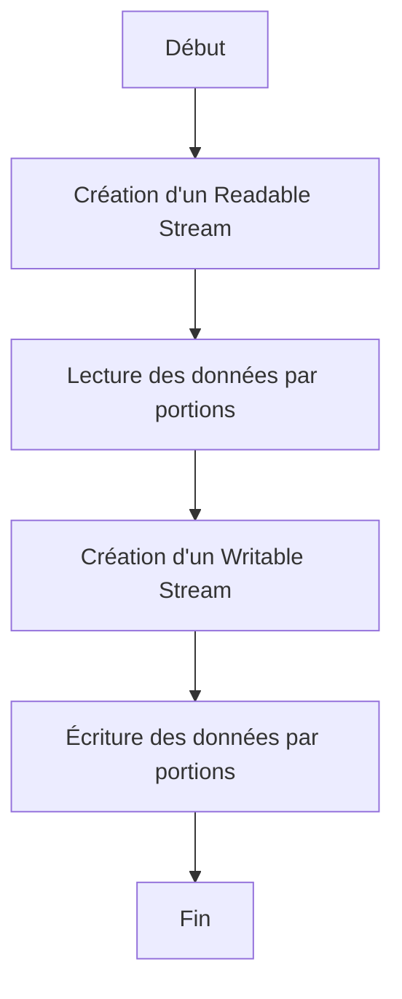

# Streams et Buffers dans Node.js

## Introduction
Les **Streams** et **Buffers** sont deux concepts fondamentaux de Node.js, particulièrement utiles pour manipuler efficacement des flux de données (comme des fichiers volumineux ou des transferts réseau) sans tout charger en mémoire.

Dans ce document, nous allons explorer les bases des streams et des buffers, leurs types, leurs utilisations et des exemples pratiques.

---

## 1. Qu'est-ce qu'un Buffer ?
Un **Buffer** est un espace mémoire temporaire, utilisé pour stocker des données binaires en attendant leur traitement.

### Exemple de Buffer

```javascript
const buffer = Buffer.from('Bonjour, Node.js!');
console.log(buffer); // Affiche un objet Buffer en hexadécimal
console.log(buffer.toString()); // Convertit le Buffer en chaîne de caractères
```

### Opérations avec les Buffers

- **Création d'un Buffer**

```javascript
const buffer = Buffer.alloc(10); // Crée un buffer de 10 octets initialisés à 0
const buffer2 = Buffer.from([72, 101, 108, 108, 111]); // Crée un buffer à partir d'un tableau d'octets
```

- **Lecture et écriture**

```javascript
const buffer = Buffer.alloc(5);
buffer.write('Hello');
console.log(buffer.toString()); // Affiche "Hello"
```

---

## 2. Qu'est-ce qu'un Stream ?
Un **Stream** est un mécanisme qui permet de lire ou écrire des données de manière séquentielle, sans tout charger en mémoire. Les streams sont très utilisés pour gérer des fichiers volumineux ou des transferts réseau.

### Types de Streams
- **Readable** : Pour lire des données (ex. : lecture d'un fichier).
- **Writable** : Pour écrire des données (ex. : écriture dans un fichier).
- **Duplex** : Lecture et écriture simultanées (ex. : sockets réseau).
- **Transform** : Transformation des données pendant leur transit (ex. : compression).

---

## 3. Exemple : Lecture d'un Fichier avec un Readable Stream

```javascript
const fs = require('fs');

const readableStream = fs.createReadStream('example.txt', { encoding: 'utf8' });

readableStream.on('data', (chunk) => {
    console.log('Nouvelle portion de données :', chunk);
});

readableStream.on('end', () => {
    console.log('Lecture terminée.');
});

readableStream.on('error', (err) => {
    console.error('Erreur lors de la lecture :', err);
});
```

### Explications
- **`fs.createReadStream`** : Crée un flux de lecture pour un fichier.
- **`data`** : Événement déclenché à chaque portion de données lue.
- **`end`** : Événement signalant que la lecture est terminée.
- **`error`** : Gestion des erreurs.

---

## 4. Exemple : Écriture dans un Fichier avec un Writable Stream

```javascript
const fs = require('fs');

const writableStream = fs.createWriteStream('output.txt');

writableStream.write('Bonjour, Node.js !\n');
writableStream.write('Les streams sont puissants.\n');
writableStream.end();

writableStream.on('finish', () => {
    console.log('Écriture terminée.');
});

writableStream.on('error', (err) => {
    console.error('Erreur lors de l'écriture :', err);
});
```

### Explications
- **`fs.createWriteStream`** : Crée un flux d'écriture.
- **`write`** : Écrit des données dans le fichier.
- **`finish`** : Événement signalant que l'écriture est terminée.
- **`error`** : Gestion des erreurs.

---

## 5. Exemple : Transformation avec un Transform Stream
Un **Transform Stream** est utilisé pour modifier les données entre la lecture et l'écriture.

### Exemple : Conversion en Majuscules

```javascript
const { Transform } = require('stream');

const transformStream = new Transform({
    transform(chunk, encoding, callback) {
        const upperChunk = chunk.toString().toUpperCase();
        callback(null, upperChunk);
    }
});

process.stdin.pipe(transformStream).pipe(process.stdout);
```

### Explications
- **`Transform`** : Permet de transformer les données lues avant de les écrire.
- **`pipe`** : Relie plusieurs streams entre eux (ici, entrée standard à sortie standard).

---

## 6. Comparaison : Lecture Complète vs Streams

| **Lecture Complète**               | **Streams**                             |
|-------------------------------------|------------------------------------------|
| Charge tout le fichier en mémoire.  | Lit ou écrit par petites portions.       |
| Consomme beaucoup de mémoire.       | Optimisé pour les fichiers volumineux.   |
| Simple à implémenter.               | Plus complexe, mais plus performant.     |

---

## 7. Cas Pratique : Copie de Fichier avec Streams

### Code

```javascript
const fs = require('fs');

const readableStream = fs.createReadStream('source.txt');
const writableStream = fs.createWriteStream('destination.txt');

readableStream.pipe(writableStream);

readableStream.on('end', () => {
    console.log('Fichier copié avec succès !');
});

readableStream.on('error', (err) => {
    console.error('Erreur lors de la copie :', err);
});
```

### Explications
- **`pipe`** : Connecte un flux de lecture à un flux d'écriture.
- Gère automatiquement la lecture et l'écriture par portions.

---

## 8. Diagramme Mermaid



---

## Conclusion
Les **Streams** et **Buffers** sont essentiels pour gérer des fichiers volumineux et optimiser les performances des applications Node.js. En combinant ces concepts avec d'autres outils comme `pipe` et `Transform`, vous pouvez manipuler efficacement des données en continu.

Si vous souhaitez des exemples supplémentaires ou des précisions, n'hésitez pas à demander !

